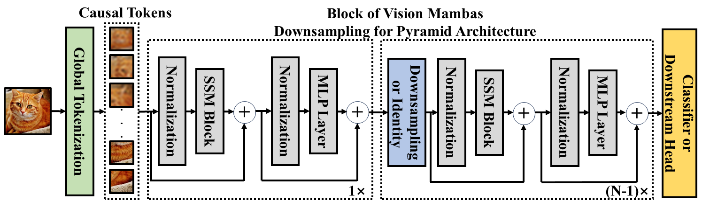
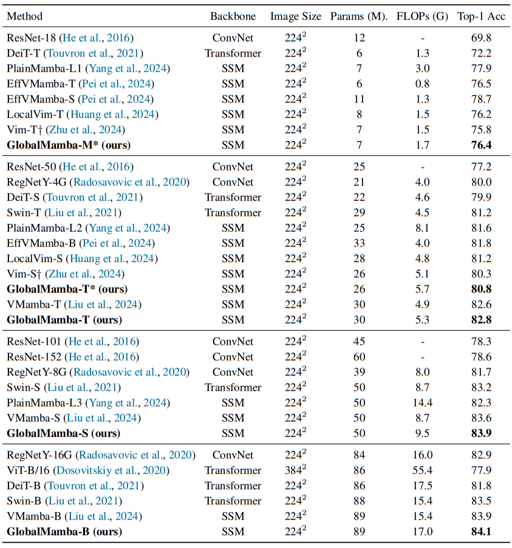

# GlobalMamba: Global Image Serialization for Vision Mamba

This repository is the official implementation of **GlobalMamba: Global Image Serialization for Vision Mamba**

## [Paper](http://arxiv.org/abs/2410.10316)

> GlobalMamba: Global Image Serialization for Vision Mamba

> [Chengkun Wang](https://scholar.google.com/citations?user=69-8jtcAAAAJ&hl=zh-CN&oi=sra), [Wenzhao Zheng](https://wzzheng.net/), [Jie Zhou](https://scholar.google.com/citations?user=6a79aPwAAAAJ&hl=en&authuser=1), [Jiwen Lu](http://ivg.au.tsinghua.edu.cn/Jiwen_Lu/)

## Motivation of GlobalMamba


Vim and VMamba adopt a flattening strategy similar to (a) and (b), transmuting two-dimensional  images into one-dimensional sequences by row or column, while LocalMamba (c) performs the corresponding flattening within a local window. Notably, these sequences lack the inherent causal sequencing of tokens that is characteristic of the causal architecture of Mamba causal architecture. Differently, GlobalMamba (d) constructs a causal token sequence by frequency, while ensuring that tokens acquire global feature information.

## Overall framework of GlobalMamba



## Environments of training

- Python 3.10.13

  - `conda create -n your_env_name python=3.10.13`

- torch 2.1.1 + cu118
  - `pip install torch==2.1.1 torchvision==0.16.1 torchaudio==2.1.1 --index-url https://download.pytorch.org/whl/cu118`

- Requirements: globalmamba_requirements.txt
  - `pip install -r globalmamba/globalmamba_requirements.txt`

- Install ``causal_conv1d`` and ``mamba``
  - `pip install -e causal_conv1d>=1.1.0`
  - `pip install -e mamba-1p1p1`

## Train Your GlobalMamba

`bash globalmamba/scripts/tiny.sh`

`bash globalmamba/scripts/small.sh`

The above code trains GlobalMamba based on Vim. We have reorganized the original token sequence based on frequency in the models_mamba.py file, so you only need to transfer this part to other vision mamba frameworks for comparison.

## Results



## Acknowledgement 
This project is based on Vision Mamba ([code](https://github.com/hustvl/Vim/tree/main)), Mamba ([code](https://github.com/state-spaces/mamba)), Causal-Conv1d ([code](https://github.com/Dao-AILab/causal-conv1d)), DeiT ([code](https://github.com/facebookresearch/deit)). Thanks for their wonderful works.

## Citation

If you find this project helpful, please consider citing the following paper:
```
@article{wang2024globalmamba,
    title={GlobalMamba: Global Image Serialization for Vision Mamba},
    author={Chengkun Wang and Wenzhao Zheng and Jie Zhou and Jiwen Lu},
    journal={arXiv preprint arXiv:2410.10316},
    year={2024}
}
```
